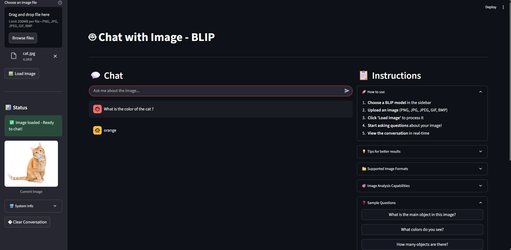

# 🤖 Chat with Image - BLIP Application



## 🌟 Features

- **📸 Image Upload**: Upload any image (PNG, JPG, JPEG, GIF, BMP)
- **💬 Interactive Chat**: Real-time chat interface with image Q&A
- **🎨 Clean UI**: Modern Streamlit interface with native styling
- **⚙️ Model Options**: Choose between different BLIP models
- **🚀 GPU Support**: Automatic GPU detection and usage
- **📱 Responsive**: Professional layout that works on all devices
- **🔄 Session Management**: Persistent chat history and image state

## 🚀 How to Run

### Method 1: Quick Start
```bash
# Install dependencies
pip install -r requirements.txt

# Run the application
streamlit run main.py
```

### Method 2: Using the batch file
```bash
# Double-click run_app.bat or run in terminal:
run_app.bat
```

### Method 3: Step by step
```bash
cd "c:\Users\Admin\Documents\AI-Python\GenAI\ChatWithImage"
pip install -r requirements.txt
streamlit run main.py
```

## 💡 Usage Instructions

1. **🌐 Open Browser**: The app will automatically open at `http://localhost:8501`

2. **📸 Upload Image**: 
   - In the sidebar, click "Choose an image file" 
   - Select your image (PNG/JPG/JPEG/GIF/BMP)
   - Click "🖼️ Load Image" to process it
   - Image preview will appear in sidebar

3. **💬 Start Chatting**:
   - Use the chat input at the bottom
   - Type your question about the image
   - Press Enter or click Send
   - View conversation history in real-time

4. **⚙️ Configure Settings**:
   - Choose different BLIP models in sidebar
   - Adjust max tokens for longer/shorter answers
   - Toggle GPU usage if available
   - View system information

## 📝 Example Questions

- "What is the main object in this image?"
- "What color is the cat?"
- "How many people are there?"
- "What is the person doing?"
- "Where is this photo taken?"
- "What time of day is it?"
- "Describe the scene in detail"

## 🔧 Features Overview

### Sidebar Panel
- **Model Selection**: Choose between BLIP model variants
- **Image Upload**: Drag & drop or click to upload images
- **Load Image Button**: Process uploaded image for chat
- **Status Panel**: Shows image loading status with preview
- **Advanced Settings**: Max tokens, GPU usage configuration
- **System Info**: CUDA availability, GPU details

### Main Chat Interface
- **Real-time Chat**: Native Streamlit chat interface
- **Message History**: Persistent conversation with image
- **Chat Input**: Bottom-anchored input for questions
- **Loading Indicators**: Spinner while AI processes

### Instructions Panel
- **How to Use**: Step-by-step guide
- **Tips**: Best practices for better results
- **Sample Questions**: Clickable example questions
- **File Format Info**: Supported image types
- **BLIP Capabilities**: What the AI can analyze

## 🎨 UI Features

- **Clean Design**: Native Streamlit styling for professional look
- **Two-Column Layout**: Chat on left, instructions on right
- **Responsive Design**: Works on desktop, tablet, and mobile
- **Native Chat Interface**: WhatsApp/ChatGPT-style messaging
- **Loading Indicators**: Real-time feedback during processing
- **Status Messages**: Clear success/error notifications
- **Image Preview**: Thumbnail in sidebar after loading

## 🛠️ Technical Details

- **Backend**: BLIP (Bootstrapping Language-Image Pre-training)
- **Frontend**: Streamlit with native components
- **Models**: Salesforce BLIP VQA variants
- **GPU**: Automatic CUDA detection and usage
- **State Management**: Session-based image and chat persistence
- **Caching**: Model caching for faster subsequent loads

## 📋 Dependencies

Install all dependencies with:
```bash
pip install -r requirements.txt
```

**Core packages:**
- `streamlit` - Web app framework
- `transformers` - BLIP model loading
- `torch` - PyTorch for AI inference
- `torchvision` - Image processing utilities
- `Pillow` - Image handling and conversion
- `numpy` - Numerical computations

## 📊 System Requirements

- **RAM**: 4GB+ (8GB+ recommended)
- **GPU**: Optional but recommended for faster inference
- **Python**: 3.8+
- **Internet**: Required for initial model download (~1-2GB)

## 🔥 Pro Tips

1. **Better Questions**: Be specific about what you want to know
2. **Image Quality**: Use clear, well-lit images for best results
3. **GPU Usage**: Enable GPU for faster responses
4. **Model Selection**: Try different models for varied results
5. **Chat History**: Review previous Q&A for context

## 🐛 Troubleshooting

### App won't start:
```bash
# Install dependencies
pip install -r requirements.txt

# Check Python version (3.8+ required)
python --version

# Try running with specific Python
python -m streamlit run main.py
```

### Model loading errors:
- Check internet connection for initial download
- Ensure enough disk space (~2-3GB for models)
- Try CPU mode if GPU fails
- Clear cache: `streamlit cache clear`

### Slow responses:
- Enable GPU in sidebar if available
- Use base model instead of large model
- Reduce max tokens setting
- Check GPU memory usage

### Image upload issues:
- Supported formats: PNG, JPG, JPEG, GIF, BMP
- File size should be < 200MB
- Try converting image format if issues persist
- Ensure image is not corrupted

### GPU not detected:
```bash
# Check CUDA installation
python -c "import torch; print(torch.cuda.is_available())"

# Install CUDA-enabled PyTorch if needed
pip install torch torchvision --index-url https://download.pytorch.org/whl/cu118
```

## 🔄 Updates & Features

### Version 2.0 Features:
- ✅ Native Streamlit chat interface
- ✅ Session state management
- ✅ Clean sidebar layout
- ✅ Clickable sample questions
- ✅ Image preview in sidebar
- ✅ Professional UI/UX

### Upcoming Features:
- 🔄 Multiple image upload
- 🔄 Image comparison mode
- 🔄 Export chat history
- 🔄 Custom model fine-tuning

## 📚 Documentation

### API Reference:
- [BLIP Paper](https://arxiv.org/abs/2201.12086)
- [Transformers Documentation](https://huggingface.co/docs/transformers)
- [Streamlit Documentation](https://docs.streamlit.io)

### Model Details:
- **blip-vqa-base**: 129M parameters, faster inference
- **blip-vqa-capfilt-large**: 224M parameters, higher accuracy

## 🎉 Enjoy chatting with your images!
"# Chat-with-Image" 
